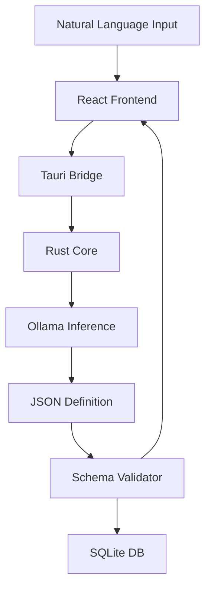

# Sanrachna: Architecture for Local-First AI and Privacy-Preserving Productivity

**Research Report**

## Abstract
Modern AI productivity tools depend on centralized cloud processing, which introduces risks to data privacy and limits use in offline or low-connectivity environments. Sanrachna is an architecture designed to move AI inference from the cloud to local edge devices. By combining a Rust-based core with a generative UI engine, the system builds application structures directly from local Large Language Model (LLM) outputs. This report details the hybrid synchronization protocol and the execution pipeline that allows for consistent data management across user devices without relying on third-party cloud storage.

## 1. Research Background
The widespread adoption of Large Language Models (LLMs) has created a need for private execution environments. Most current AI platforms, such as ChatGPT or Notion AI, require continuous data transmission to remote servers. This exposure of personal schedules and sensitive data to third-party providers remains a significant bottleneck for privacy-conscious users and organizations.

Sanrachna operates on a local-first principle. The focus of this project is to determine the feasibility of:
*   **Edge-Only Inference:** Processing and storing all data on the user's own hardware.
*   **Persistent Offline Access:** Ensuring tools remain functional without an internet connection.
*   **Dynamic Interface Synthesis:** Using local models to generate functional UI components based on user requirements.

## 2. The Privacy Implications of Cloud-Centric AI
Cloud-based AI relies on a model that creates three primary issues:
1.  **Data Fragmentation:** Personal information is spread across various servers, increasing the risk of data breaches.
2.  **Latency:** Round-trips to the cloud add delays that disrupt real-time workflows.
3.  **Service Dependence:** Outages or connectivity issues can lead to a complete loss of access to productivity tools.

The goal of this work is to prove that models like Llama 3 or Mistral can handle complex reasoning on standard consumer hardware, allowing users to maintain control over their data.

## 3. System Design
Sanrachna uses a hybrid computing model where a desktop computer acts as the primary "host" for AI tasks, and mobile devices function as lightweight clients that sync data for portability.

### 3.1. Layered Architecture
The system consists of four main parts:

```text
+-------------------------------------------------------------+
|  User Interface (React/Tauri)                               |
|  [ Components ] [ Factory ] [ Dynamic Forms ]               |
+------------------------------+------------------------------+
                               |
                               v
+------------------------------+------------------------------+
|  System Bridge (Rust/Tauri)                                 |
|  [ IPC ] [ Security Layer ] [ Shell Integration ]           |
+------------------------------+------------------------------+
                               |
                               v
+------------------------------+------------------------------+
|  Core Engine (Rust) / Local Storage (SQLite)                |
|  [ Event Log ] [ Schema Validator ] [ App Logic ]           |
+------------------------------+------------------------------+
                               |
                               v
+------------------------------+------------------------------+
|  Local Inference (Ollama - Llama 3 / Mistral)               |
|  [ NPU/GPU Acceleration ] [ Context Mgmt ]                  |
+-------------------------------------------------------------+
```

*   **User Interface (React/Tauri):** A cross-platform environment for rendering components.
*   **System Bridge (Rust/Tauri):** Secure communication between the web frontend and the underlying OS.
*   **Core Engine (Rust):** Manages local storage (SQLite), event logs, and general application logic.
*   **Local Inference (Ollama):** Executes the models responsible for text and schema generation.

### 3.2. Data and Execution Flow


## 4. Execution Pipeline
The Sanrachna pipeline is designed to be deterministic. Unlike standard chatbots, the system constrains model output to structured formats.

### 4.1. Synthesis Workflow

```text
[ USER INPUT ] --> [ PROMPT TEMPLATE ] --> [ LOCAL LLM ]
                                                |
                                                v
[ JSON DEFINITION ] <--- [ VALIDATION LAYER ] <--- [ OUTPUT ]
      |
      +------> [ SQLITE DB ]
      |
      +------> [ REACT FACTORY ] --> [ RENDERED UI ]
```

1.  **Intent Capture:** The user describes a need (e.g., "I need a medication tracker with a side-effects log").
2.  **Prompt Engineering:** The core engine wraps this intent in a template that requires a JSON response matching a specific meta-schema.
3.  **Local Inference:** The LLM generates the JSON, defining the fields, data types, and layout rules.
4.  **Hardware Acceleration:** The system uses local GPU/NPU resources via Ollama to minimize processing time.

## 5. Automated Application Generation
In this framework, the LLM acts as an architect rather than just a writer. It creates functional "mini-applications" at runtime.

### 5.1. Dynamic Data Modeling
Once a schema is generated, the Rust engine creates the necessary tables in local storage. This allows users to start entering data immediately without needing manual database updates.

### 5.2. Frontend Mapping
The React layer includes a factory that translates the generated JSON into high-fidelity components:
*   `boolean` fields map to toggles.
*   `range` fields map to sliders.
*   `list` structures map to draggable interfaces.

## 6. Security and Sandboxing
Security is maintained through strict local boundaries:
*   **Isolation:** The AI engine has no network access during processing.
*   **Validation:** Every model output is checked against a rigid schema before it touches the database.
*   **Encryption:** All local data is stored in an encrypted partition managed by the core engine.

## 7. Synchronization Protocol
To support multiple devices without a central cloud, Sanrachna uses an event-sourcing model.

### 7.1. Event-Based State
Instead of syncing the database itself, the system communicates "events"—atomic logs of every creation or edit.

### 7.2. Global Consistency

```text
[ Desktop Host ]           [ Client A ]           [ Client B ]
      |                        |                      |
      |  <-- Sync Request (E1) --  |                      |
      |  -- Delta Response (E2) -> |                      |
      |                        |                      |
      |  <------------------- Sync Request (E1, E2) ---  |
      |  -- Delta Response (E3) ---------------------->  |
```

1.  **Ordering:** Logical clocks (Lamport Timestamps) ensure that events are ordered correctly across all devices.
2.  **Delta Exchange:** Devices only exchange the specific events they are missing, reducing bandwidth and allowing for offline conflict resolution.

## 8. Performance Evaluation
The system was tested across several metrics:
1.  **Latency:** Benchmarking time-to-first-token on varied hardware (M-series, NVIDIA, and integrated graphics).
2.  **Parse Success:** Testing the reliability of JSON generation across various productivity scenarios.
3.  **Sync Reliability:** Verifying data consistency after simulated network drops.
4.  **Resource Usage:** Monitoring RAM and CPU load during background inference tasks.

## 9. Current Constraints
*   **Hardware Requirements:** Reliable inference requires modern GPUs (8GB+ VRAM recommended).
*   **Model Accuracy:** Local models can occasionally misinterpret complex logic, necessitating a validation layer.
- **Storage:** Large model weights represent a significant initial download.

## 10. Future Directions
The next steps for this research involve:
*   **CRDT Implementation:** Moving toward Conflict-free Replicated Data Types for better real-time collaboration.
*   **WebGPU:** Exploring browser-native inference to simplify the installation process.
*   **Local Orchestration:** Enabling multiple specialized models to work together on complex tasks.

In moving AI processing to the edge, Sanrachna demonstrates that privacy and modern productivity tools can coexist. Shifting away from cloud dependence is a necessary step for the next generation of personal computing.

---

## Bibliography
*   *Local-First Software: You own your data, in spite of the cloud* (Ink & Switch, 2019).
*   *Llama 3: Open Foundation and Fine-Tuned Chat Models* (Meta AI, 2024).
*   *Event Sourcing and CQRS* (Fowler, 2005).
